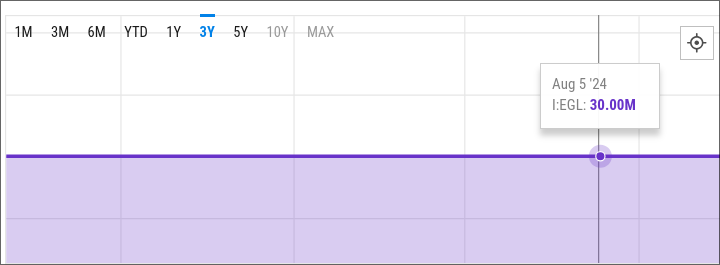
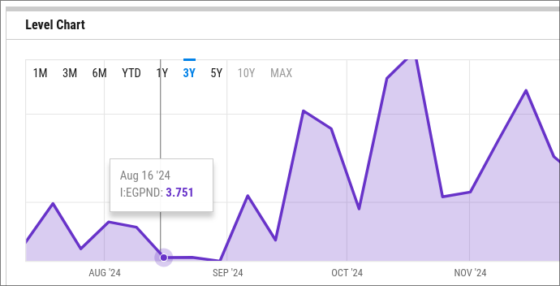

+++
title = "Deploying Lookup Table Contracts"
date = 2024-12-20

[taxonomies]
tags = ["solidity", "huff", "evm", "blockchain", "ethereum"]

[extra]
code_block_name_links = true
+++
A lookup table is a way to evaluate a poker hand using the algorithm defined in [PokerHandEvaluator](https://github.com/HenryRLee/PokerHandEvaluator/blob/develop/Documentation/Algorithm.md). The table itself is an array of [thousands of numbers](https://github.com/thlorenz/phe/blob/master/lib/hashtable7.js). Luckily [dxganta](https://github.com/dxganta/poker-solidity) has split these tables into smaller arrays that we can use in Solidity. 

#### V1
```solidity,name=https://github.com/dxganta/poker-solidity/blob/main/contracts/noFlush/NoFlush1.sol
contract NoFlush1 {
  uint[3000] public noflush = [
  11, 23, 11, 167,  23, 11, 167,  179,
  23, 12, 168,  191,  180,  24, 35, 35,
  35, 36, 11, 167,  23, 11, 167,  179,
  23, 12, 168,  2468, 180,  24, 168,  191,
  192,  180,  35, 35, 36, 11, 167,  179,
  23, 12, 169,  2468, 181,  24, 168,  2479,
  2600, 180,  191,  193,  192,  35, 36, 13,
  169,  203,  181,  25, 169,  203,  204,  181,
  203,  205,  204,  193,  193,  37, 47, 47,
  47, 48, 47, 47, 48, 47, 48, 49,
  11, 167,  23, 11, 167,  179,  23, 12,
  ....
  ];
}
```

Even though these are smaller, at 3000 elements, they were still too big to deploy in a single transaction. A deployment simulation using Foundry costs `66744705` (~66M) gas.

```shell
❯ forge script script/NoFlushDeployV1.s.sol:NoFlushDeploy -vvvv
Traces:
  [66744705] NoFlushDeploy::run()
    ├─ [0] VM::startBroadcast()
    │   └─ ← [Return]
    ├─ [66693141] → new NoFlush1@0x7FA9385bE102ac3EAc297483Dd6233D62b3e1496
    │   └─ ← [Return] 286 bytes of code
    ├─ [0] VM::stopBroadcast()
    │   └─ ← [Return]
    └─ ← [Stop]
```

This makes it impossible to deploy, since the current maximum block gas limit is `30M`. 

One thing we can do is take the table content out of the contract and initialize it using subsequent transactions, which brings us to V2.

#### V2

Entirely remove the table and try to initialize the content with `append` in chunks of 1000 elements.

```solidity
// SPDX-License-Identifier: GPL-3.0
pragma solidity >=0.7.0 <0.9.0;

contract NoFlush1 {
    uint[] public noflush;

    function append(bytes calldata arrBytes) public returns (uint) {
        uint[1000] memory arr = abi.decode(arrBytes, (uint[1000]));
        for (uint i; i < 1000; i++) {
            noflush.push(arr[i]);
        }
        return arr[999];
    }
}

contract NoFlushDeploy is Script {
    NoFlush1 public noFlush1;

    uint16[1000] public arr_1 = [
        11, 23, 11, 167, 23, 11, 167, 179, 23, 12, 168, 191, 180, 24, 35, 35, 35, 36, 11, 167, 23, 11, 167, 179, 23,
        ...
    ];
    uint16[1000] public arr_2 = [
        2842, 2843, 2724, 207, 207, 207, 51, 171, 2512, 2633, 183, 2513, 4426, 2634, 2743, 2744, 195, 2514, 4427, 2635, 1602, 1601, 1602, 2842, 2843,
        ...
    ];
    uint16[1000] public arr_3 = [
        2470, 1678, 26, 1622, 3327, 3547, 1688, 2481, 3767, 2602, 1744, 1754, 38, 1631, 3336, 3556, 1697, 3381, 1600, 3601, 3776, 3821, 1763, 2492, 3987, 2613, 3996, 4041, 2723,
        ...
    ];

    function run() public {
        bytes memory bytes_1 = abi.encodePacked(arr_1);
        bytes memory bytes_2 = abi.encodePacked(arr_2);
        bytes memory bytes_3 = abi.encodePacked(arr_3);

        vm.startBroadcast();

        noFlush1 = new NoFlush1();
        noFlush1.append(bytes_1);
        noFlush1.append(bytes_2);
        noFlush1.append(bytes_3);

        vm.stopBroadcast();

        vm.assertEq(noFlush1.noflush(999), 2614);
        vm.assertEq(noFlush1.noflush(1999), 1612);
        vm.assertEq(noFlush1.noflush(2999), 2073);

    }
```

The deploy script uses 69M gas across four transactions.

```shell
❯ forge script script/NoFlushDeployV2.s.sol:NoFlushDeploy -vvvv
No files changed, compilation skipped
Traces:
  [69927358] NoFlushDeploy::run()
    ├─ [0] VM::startBroadcast()
    │   └─ ← [Return]
    ├─ [210249] → new NoFlush1@0x7FA9385bE102ac3EAc297483Dd6233D62b3e1496
    │   └─ ← [Return] 1050 bytes of code
    ├─ [22765985] NoFlush1::append(0x000000000000000000000000000000000000000000000000000000000000000b0000000000000000000000000000000000000000000000000000000000000017...)
    │   └─ ← [Stop]
    ├─ [22744085] NoFlush1::append(0x0000000000000000000000000000000000000000000000000000000000000b1a0000000000000000000000000000000000000000000000000000000000000b1b...)
    │   └─ ← [Stop]
    ├─ [22744085] NoFlush1::append(0x00000000000000000000000000000000000000000000000000000000000009a6000000000000000000000000000000000000000000000000000000000000068e...)
    │   └─ ← [Stop]
    ├─ [0] VM::stopBroadcast()
    │   └─ ← [Return]
    ├─ [870] NoFlush1::noflush(999) [staticcall]
    │   └─ ← [Return] 2614
    ├─ [0] VM::assertEq(2614, 2614) [staticcall]
    │   └─ ← [Return]
    ├─ [870] NoFlush1::noflush(1999) [staticcall]
    │   └─ ← [Return] 1612
    ├─ [0] VM::assertEq(1612, 1612) [staticcall]
    │   └─ ← [Return]
    ├─ [870] NoFlush1::noflush(2999) [staticcall]
    │   └─ ← [Return] 2073
    ├─ [0] VM::assertEq(2073, 2073) [staticcall]
    │   └─ ← [Return]
    └─ ← [Stop]


Script ran successfully.
Gas used: 69948422
```

Given current gas prices of 3.751 Gwei per gas, it would cost us `0.26239972 ETH`. 
With this approach, we are able to deploy the contract and retrieve the elements for lookup, but we are paying a high price for a very simple contract. Not to mention, we have a total of [**11**](https://github.com/dxganta/poker-solidity/tree/main/contracts/noFlush) contracts to deploy just to match NoFlush hands. That would be well above 2 ETH in total.

But if we look closer at the argument passed to the `append` function, we can see that it has a lot of zeros. Every zero byte in the calldata costs 4 gas (see [Gas Costs](https://www.evm.codes/about#gascosts)) before execution even begins.

When analyzing the lookup table, I noticed each number can fit in `uint16` instead of `uint256`, so we only need two bytes per element. For every element, we are overpaying `4 * 30 = 120` gas (4 * number of bytes unused, which is 32-2), for a total of `120000` gas per `1000`-element chunk.

But there is no actual `uint16` in the EVM, and it will be converted to `uint256`, which results in too many padded zeros. If we can convert each 1000-element chunk to a compact hex string that uses only 2 bytes instead of 32 bytes, then in `append` we can convert them back to `uint256`.

Takeaway: calldata padding is the main cost driver here, so packing bytes should cut a large chunk of gas.

#### V3

V3 uses a similar approach to V2, but it packs the elements, using only 2 bytes of calldata per element, and stores them in the `noflush` array using assembly for further gas reduction.

```solidity
contract NoFlushDeploy is Script {
    NoFlush1 public noFlush1;

    uint16[1000] public arr_1 = [
        11, 23, 11, 167, 23, 11, 167, 179, 23, 12, 168, 191, 180, 24, 35, 35,
		....
    ];

    uint16[1000] public arr_2 = [
        2842, 2843, 2724, 207, 207, 207, 51, 171, 2512, 2633, 183, 2513, 4426,
		....
    ];

    uint16[1000] public arr_3 = [
        2470, 1678, 26, 1622, 3327, 3547, 1688, 2481, 3767, 2602, 1744, 1754,
		....
    ];

    function setUp() public {}

    function _packUint16Array(uint16[1000] storage arr) internal view returns (bytes memory out) {
        out = new bytes(2000);
        for (uint i; i < 1000; i++) {
            uint16 v = arr[i];
            uint o = i * 2;
            out[o] = bytes1(uint8(v >> 8));
            out[o + 1] = bytes1(uint8(v));
        }
    }

    function run() public {
        // Pack to 2 bytes per entry instead of 32-bytes ABI words.
        bytes memory bytes_1 = _packUint16Array(arr_1);
        bytes memory bytes_2 = _packUint16Array(arr_2);
        bytes memory bytes_3 = _packUint16Array(arr_3);

        vm.startBroadcast();

        noFlush1 = new NoFlush1();
        noFlush1.append(bytes_1);
        noFlush1.append(bytes_2);
        noFlush1.append(bytes_3);

        vm.stopBroadcast();

        vm.assertEq(noFlush1.noflush(999), 2614);
        vm.assertEq(noFlush1.noflush(1999), 1612);
        vm.assertEq(noFlush1.noflush(2999), 2073);
    }
}

contract NoFlush1 {
    uint[] public noflush;

    function append(bytes calldata arrBytes) public {
        // - Packed uint16[1000] encoding: 1000 * 2 bytes (big-endian)
        assembly {
            // Preserve Solidity bounds checks (indexing into calldata bytes would revert).
            if lt(arrBytes.length, 2000) {
                revert(0, 0)
            }

            // Append 1000 elements while only updating the array length once.
            let lenSlot := noflush.slot
            let len := sload(lenSlot)
            sstore(lenSlot, add(len, 1000))

            // base = keccak256(lenSlot)
            mstore(0x00, lenSlot)
            let dest := add(keccak256(0x00, 0x20), len)

            let src := arrBytes.offset
            for { let i := 0 } lt(i, 1000) { i := add(i, 1) } {
                // v = (arrBytes[o] << 8) | arrBytes[o + 1]
                let v := shr(240, calldataload(src))
                sstore(dest, v)
                dest := add(dest, 1)
                src := add(src, 2)
            }
        }
    }
}
```

Gas reporting from the deploy script shows that it didn't make much difference.

```shell
❯ forge script script/NoFlushDeployV3.s.sol:NoFlushDeploy -vvvv
Traces:
  [69994964] NoFlushDeploy::run()
    ├─ [0] VM::startBroadcast()
    │   └─ ← [Return]
    ├─ [123769] → new NoFlush1@0x7FA9385bE102ac3EAc297483Dd6233D62b3e1496
    │   └─ ← [Return] 618 bytes of code
    ├─ [22221688] NoFlush1::append(0x000b0017000b00a7....)
    │   └─ ← [Stop]
    ├─ [22199788] NoFlush1::append(0x0b1a0b1b0aa400cf....)
    │   └─ ← [Stop]
    ├─ [22199788] NoFlush1::append(0x09a6068e001a0656....)
    │   └─ ← [Stop]
    ├─ [0] VM::stopBroadcast()
    │   └─ ← [Return]
    ├─ [870] NoFlush1::noflush(999) [staticcall]
    │   └─ ← [Return] 2614
    ├─ [0] VM::assertEq(2614, 2614) [staticcall]
    │   └─ ← [Return]
    ├─ [870] NoFlush1::noflush(1999) [staticcall]
    │   └─ ← [Return] 1612
    ├─ [0] VM::assertEq(1612, 1612) [staticcall]
    │   └─ ← [Return]
    ├─ [870] NoFlush1::noflush(2999) [staticcall]
    │   └─ ← [Return] 2073
    ├─ [0] VM::assertEq(2073, 2073) [staticcall]
    │   └─ ← [Return]
    └─ ← [Stop]


Script ran successfully.
Gas used: 70016028
```

#### V4

V4 tries an entirely new approach. A hex string of 3000 `uint16` elements would need 6000 bytes (~6 KB). Since the contract size limit is 24 KB, what if we put the 6 KB string in the code itself? That way, we don't need to store the array in a storage slot, and when reading the element for a given index we can just find the value in the runtime code. You can read about creation and runtime code in [this](https://ethereum.stackexchange.com/questions/76334/what-is-the-difference-between-bytecode-init-code-deployed-bytecode-creation) wonderful Stack Exchange thread. Solidity provides `codesize` and `codecopy` opcodes to access the smart contract's code itself. Our approach here is:

- First create a contract that has a function to get element for a given index.
- Then get this contract's runtime code using `type(NoFlush1).runtimeCode`.
- Append a 6000-byte hex string to this runtime code along with the length.
- Prepare `initCode` for our `runtimeCode`.
- Deploy.

```solidity
contract NoFlush1 {
    // The packed uint16 table is appended to this contract's *runtime bytecode* as:
    // [ ...runtime code... ][ table bytes ][ uint256(tableLen) ]
    function lookup(uint256) external pure returns (uint256) {
        assembly {
            // Load index from calldata.
            let i := calldataload(0x04)

            // Read tableLen from the last 32 bytes of runtime code.
            let end := codesize()
            codecopy(0x00, sub(end, 0x20), 0x20)
            let tableLen := mload(0x00)

            // Each 32-byte word stores 16 uint16 entries.
            let divv := div(i, 0x10)
            let modd := mod(i, 0x10)

            // Copy the 32-byte chunk from the code table into memory.
            let tableStart := sub(sub(end, 0x20), tableLen)
            let wordOffset := add(tableStart, mul(divv, 0x20))
            codecopy(0x00, wordOffset, 0x20)
            let word := mload(0x00)

            // Extract big-endian uint16 within the word.
            let idx := mul(modd, 0x02)
            let b1 := byte(idx, word)
            let b0 := byte(add(idx, 0x01), word)
            mstore(0x00, or(shl(0x08, b1), b0))
            return(0x00, 0x20)
        }
    }
}

contract NoFlushDeploy is Script {
    bytes public arr =
        hex"000b0017000b00a70017000b00a700b30017000c00a800bf00b4001800230023..."
		....
        hex"00ad00fb00fc00b900fb081800fc00fd00fd00c500fb081800fc0819082300fd...";

    function setUp() public {}

    function run() public {

        vm.startBroadcast();

        // Deploy a contract whose *runtime* is:
        // [type(NoFlush1).runtimeCode][arr][uint256(arr.length)]
        //
        // NOTE: `create` expects initcode, not runtime. So we build a tiny initcode
        // that CODECOPYs the embedded payload into memory and RETURNs it.
        bytes memory payload = bytes.concat(
            type(NoFlush1).runtimeCode, 
            arr, 
            abi.encode(uint256(arr.length))
        );
        uint256 payloadLen = payload.length;
        require(payloadLen <= 0xffff, "payload too big");

        // initcode (15 bytes prefix + payload):
        // 0x61 <len> 0x61 0x000f 0x60 0x00 0x39 0x61 <len> 0x60 0x00 0xf3
        bytes memory initcode = new bytes(15 + payloadLen);
        assembly {
            let p := add(initcode, 0x20)
            let lenHi := and(shr(8, payloadLen), 0xff)
            let lenLo := and(payloadLen, 0xff)

            mstore8(add(p, 0), 0x61)
            mstore8(add(p, 1), lenHi)
            mstore8(add(p, 2), lenLo)
            mstore8(add(p, 3), 0x61)
            mstore8(add(p, 4), 0x00)
            mstore8(add(p, 5), 0x0f)
            mstore8(add(p, 6), 0x60)
            mstore8(add(p, 7), 0x00)
            mstore8(add(p, 8), 0x39)
            mstore8(add(p, 9), 0x61)
            mstore8(add(p, 10), lenHi)
            mstore8(add(p, 11), lenLo)
            mstore8(add(p, 12), 0x60)
            mstore8(add(p, 13), 0x00)
            mstore8(add(p, 14), 0xf3)

            let dst := add(p, 15)
            let src := add(payload, 0x20)
            for { let i := 0 } lt(i, payloadLen) { i := add(i, 0x20) } {
                mstore(add(dst, i), mload(add(src, i)))
            }
        }

        address addr;
        assembly {
            addr := create(0, add(initcode, 0x20), mload(initcode))
            if iszero(addr) { revert(0, 0) }
        }
        noFlush1 = NoFlush1(addr);

        vm.stopBroadcast();

        vm.assertEq(noFlush1.lookup(999), 2614);
        vm.assertEq(noFlush1.lookup(1999), 1612);
        vm.assertEq(noFlush1.lookup(2999), 2073);
    }
}
```

Deploying it would cost us `1779007` gas, which is way lower than the 30M gas limit. Voila.

```shell
❯ forge script script/NoFlushDeployV4.s.sol:NoFlushDeploy -vvvv
Traces:
  [1757943] NoFlushDeploy::run()
    ├─ [0] VM::startBroadcast()
    │   └─ ← [Return]
    ├─ [1278096] → new <unknown>@0x7FA9385bE102ac3EAc297483Dd6233D62b3e1496
    │   └─ ← [Return] 6384 bytes of code
    ├─ [0] VM::stopBroadcast()
    │   └─ ← [Return]
    ├─ [536] 0x7FA9385bE102ac3EAc297483Dd6233D62b3e1496::lookup(999) [staticcall]
    │   └─ ← [Return] 2614
    ├─ [0] VM::assertEq(2614, 2614) [staticcall]
    │   └─ ← [Return]
    ├─ [536] 0x7FA9385bE102ac3EAc297483Dd6233D62b3e1496::lookup(1999) [staticcall]
    │   └─ ← [Return] 1612
    ├─ [0] VM::assertEq(1612, 1612) [staticcall]
    │   └─ ← [Return]
    ├─ [536] 0x7FA9385bE102ac3EAc297483Dd6233D62b3e1496::lookup(2999) [staticcall]
    │   └─ ← [Return] 2073
    ├─ [0] VM::assertEq(2073, 2073) [staticcall]
    │   └─ ← [Return]
    └─ ← [Stop]


Script ran successfully.
Gas used: 1779007
```

#### V5

With V5, we use Huff [Code Tables](https://docs.huff.sh/get-started/huff-by-example/#code-tables) to further reduce gas. Huff is a low-level language that allows us to access the EVM stack using bytecodes, giving us total control. The idea is similar to V4, but more visible and elegant, since all the hairy stuff for creating `initCode` from `runtimeCode` is handled by [foundry-huff](https://github.com/huff-language/foundry-huff). 

```asm,name=src/huff/NoFlush1.huff
/* Interface */
#define function lookup(uint256) view returns (uint256)

#define table CODE_TABLE {
  0x000B0017000B00A70017000B00A700B30017000C00A800BF00B400180023002300.....
}

#define macro LOOKUP() = takes (0) returns (0) {
    0x04 calldataload   // [number]
    0x10                // [0x10, number]
    dup1                // [0x10, 0x10, number]
    dup3                // [number, 0x10, 0x10, number]
    div                 // [div, 0x10, number]
    swap2               // [number, 0x10, div]
    mod                 // [mod, div]

    0x20                // [32, mod, div]
    dup3 0x20 mul       // [div*32 , 32, mod, div]
    __tablestart(CODE_TABLE)
    add                         //[start+div*32, 32, mod, div]
    0x60                        //[0x60, start, 32 , mod, div]
    codecopy

    //access word from code_table
    0x60 mload               //[word, mod, div]

    swap1 0x02 mul      //[idx, word]
    dup1                //[idx, idx, word]
    dup3                //[word, idx ,idx, word]
    swap1               //[idx, word, idx, word]
    byte                //[b1, idx, word]
    swap2
    swap1               //[idx, word, b1]
    0x01 add
    byte                //[b0, b1]
    swap1               //[b1, b0]
    0x08 shl            //[b1<<8, b0]
    or                  //[ans, mem_offset]
    dup2 mstore         //[mem_offset]
    0x20 swap1 return
}

#define macro MAIN() = takes (0) returns (0) {
    // Identify which function is being called.
    0x00 calldataload 0xE0 shr
    dup1 0x3fb5c1cb eq lookup jumpi

    lookup:
        LOOKUP()

}
```

```solidity
// SPDX-License-Identifier: Unlicense

pragma solidity ^0.8.26;

import {Script, console} from "forge-std/Script.sol";
import {HuffDeployer} from "foundry-huff/HuffDeployer.sol";

interface ILookup {
    function lookup(uint256) view external returns (uint256);
}
contract NoFlushDeploy is Script {
    function setUp() public {}

    function run() public {
        address nf1 = HuffDeployer.deploy("huff/NoFlush1");
        ILookup huff_nf1 = ILookup(nf1);

        vm.assertEq(huff_nf1.lookup(999), 2614);
        vm.assertEq(huff_nf1.lookup(1999), 1612);
        vm.assertEq(huff_nf1.lookup(2999), 2073);
    }
}
```

When we run the deploy script, foundry-huff does some prerequisite steps to deploy the Huff code. Our concern is the deployment cost of the contract, which is `1218033` gas, and calling the `lookup` method, which costs `171` gas per call.

```shell
❯ forge script script/NoFlushDeployV5.s.sol:NoFlushDeploy -vvvv
Traces:
  [4718120] NoFlushDeploy::run()
    ├─ [3279174] → new HuffConfig@0x5aAdFB43eF8dAF45DD80F4676345b7676f1D70e3
    │   └─ ← [Return] 16267 bytes of code
    ├─ [1395974] HuffConfig::deploy("huff/NoFlush1")
0x6117c480600a3d393df35f3560e01c80633fb5c1cb14610010575b6004356010808204910....
    │   ├─ [1218033] → new <unknown>@0xd9003177dC465aAA89e20678675dca7FA5f5CAD5
    │   │   └─ ← [Return] 6084 bytes of code
    │   └─ ← [Return] 0xd9003177dC465aAA89e20678675dca7FA5f5CAD5
    ├─ [171] 0xd9003177dC465aAA89e20678675dca7FA5f5CAD5::lookup(999) [staticcall]
    │   └─ ← [Return] 2614
    ├─ [0] VM::assertEq(2614, 2614) [staticcall]
    │   └─ ← [Return]
    ├─ [174] 0xd9003177dC465aAA89e20678675dca7FA5f5CAD5::lookup(1999) [staticcall]
    │   └─ ← [Return] 1612
    ├─ [0] VM::assertEq(1612, 1612) [staticcall]
    │   └─ ← [Return]
    ├─ [180] 0xd9003177dC465aAA89e20678675dca7FA5f5CAD5::lookup(2999) [staticcall]
    │   └─ ← [Return] 2073
    ├─ [0] VM::assertEq(2073, 2073) [staticcall]
    │   └─ ← [Return]
    └─ ← [Stop]


Script ran successfully.
Gas used: 4739184
```

Cheers!
